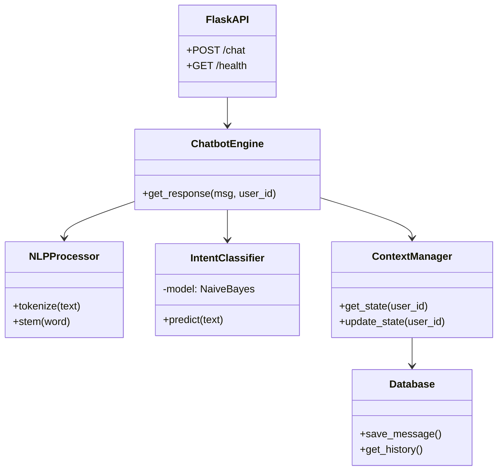

# 🏗️ System Architecture

This document describes the high-level architecture and design decisions behind the AI Chatbot.

## 1. High-Level Overview

The system is designed as a **Modular Monolith** with clear separation of concerns between:

1. **Presentation Layer**: Web UI (HTML/JS/CSS).
2. **API Layer**: Flask REST API.
3. **Application Layer**: Chatbot Engine, Context Management.
4. **Domain Layer**: NLP, Sentiment Analysis, Intent Classification.
5. **Infrastructure Layer**: Database (SQLite), External APIs.

## 2. Component Diagram

## 3. Data Flow

### Request Lifecycle

1. **User** sends message via Web UI.
2. **API** receives JSON payload (`{message, session_id}`).
3. **Chatbot Engine**:
    * **Sentiment Analysis**: Scans input for emotion.
    * **Logging**: Saves user message to SQLite.
    * **Context Check**: Retrieves session state (e.g., 'awaiting_city').
    * **Intent Classification**: Vectorizes text -> Predicts Intent.
    * **Resolution**:
        * If `weather` intent -> Calls Weather API.
        * If `greeting` intent -> Returns template response.
    * **Response Generation**: Formats final text.
4. **API** returns JSON response.
5. **UI** renders message bubble.

## 4. Design Decisions

### Why SQLite?

* **Decision**: Use SQLite instead of PostgreSQL.
* **Reasoning**: Zero configuration, portability for a portfolio project, and sufficient performance for demonstration purposes. easy to mock for testing.

### Why Naive Bayes?

* **Decision**: Use Naive Bayes for intent classification.
* **Reasoning**: Highly effective for text classification with small datasets. Fast training and inference times compared to Transformers/BERT, making it suitable for a lightweight local bot.

### Why Flask?

* **Decision**: Flask over Django.
* **Reasoning**: Microframework approach allows for explicit architecture design without "magic". Perfect for learning API fundamentals.
